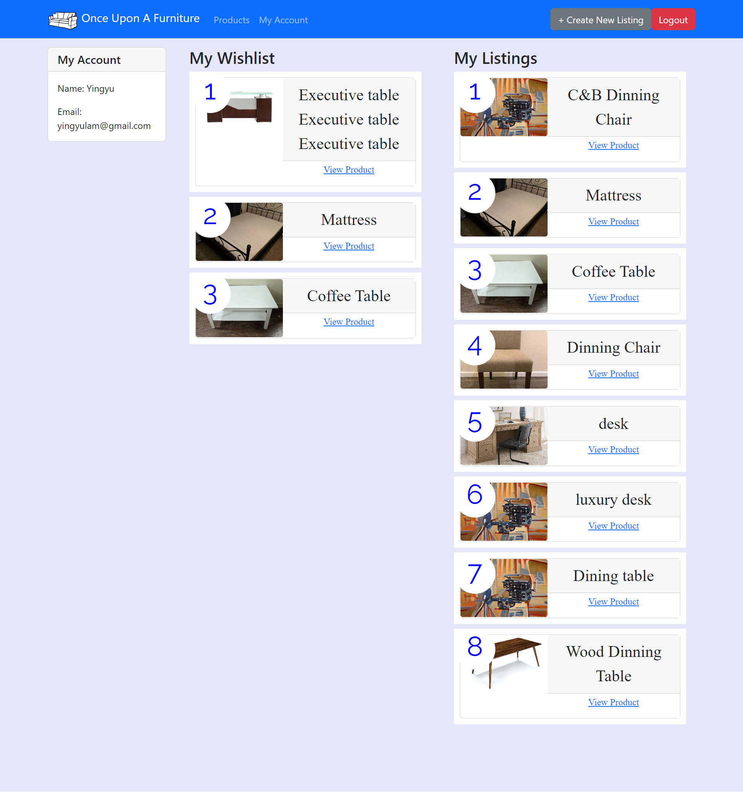
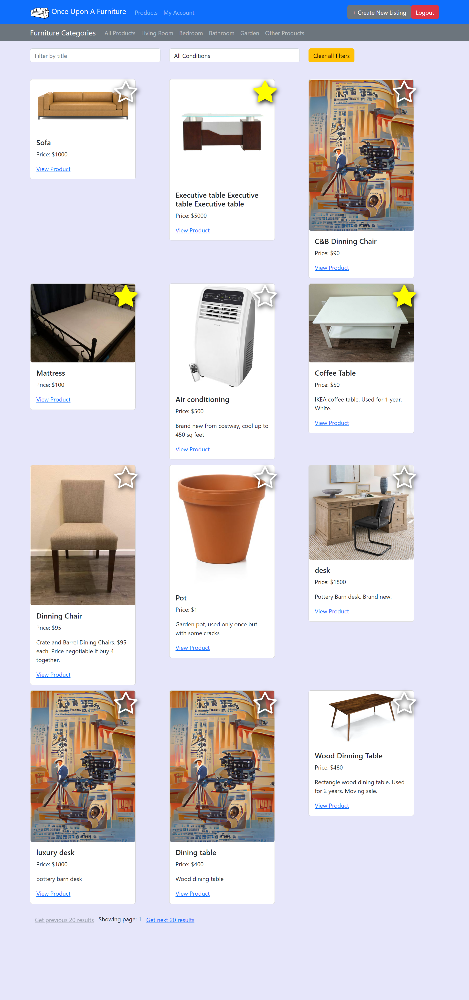
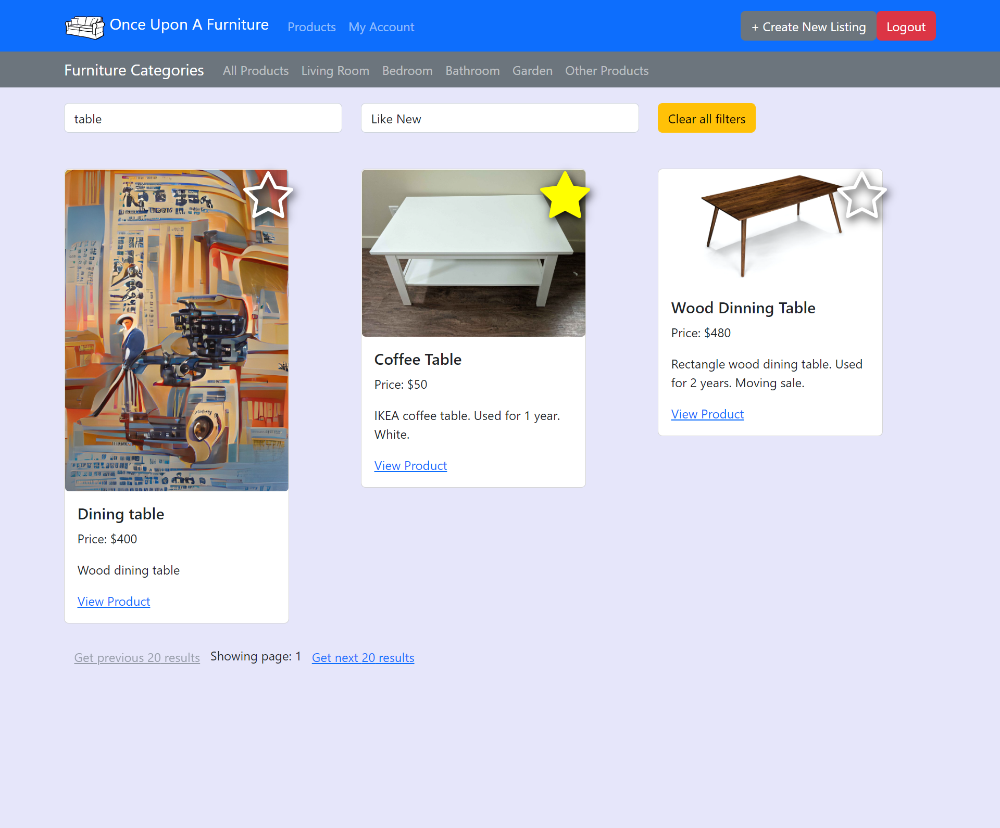
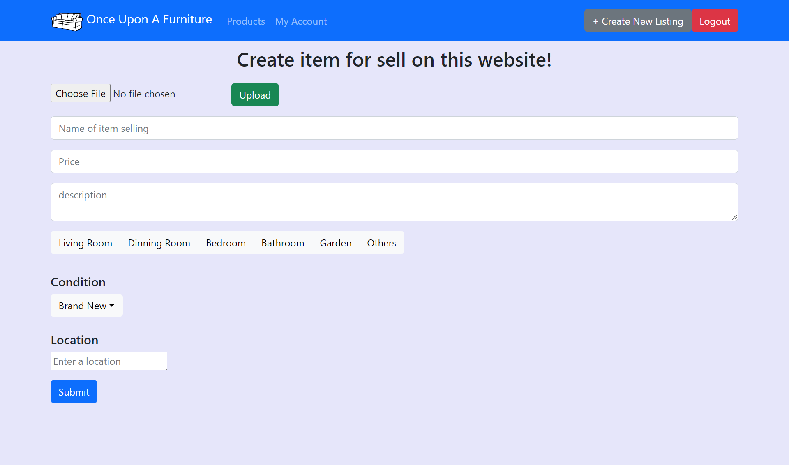
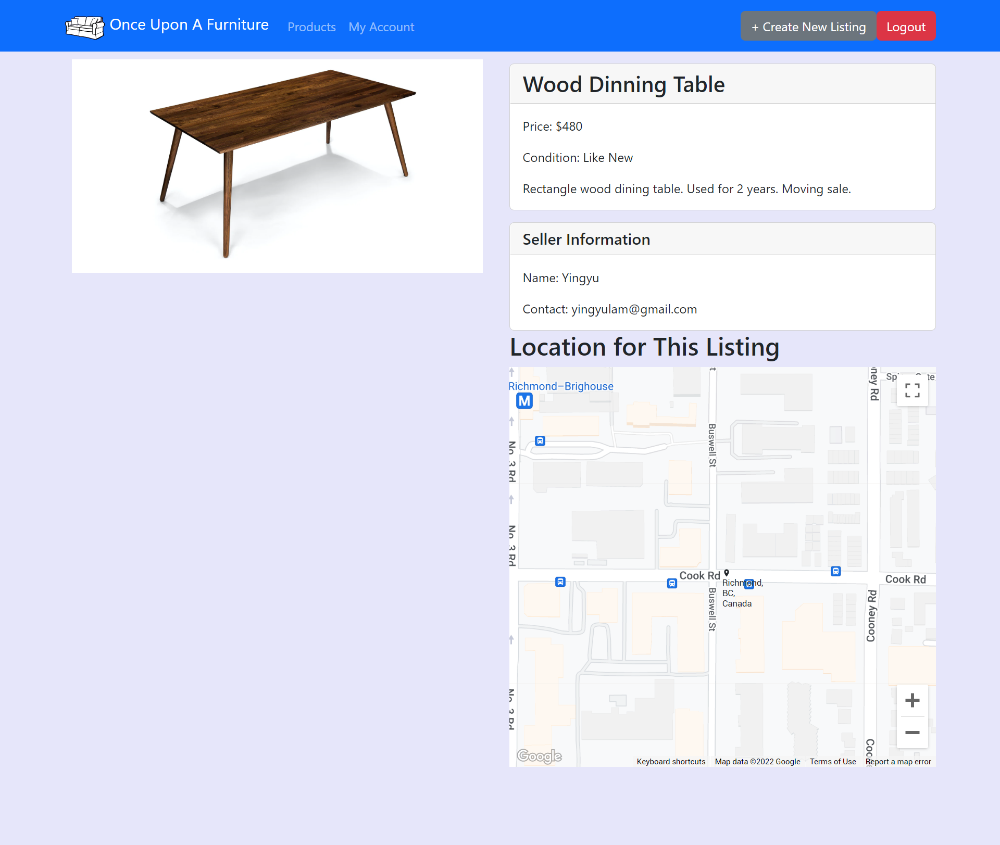
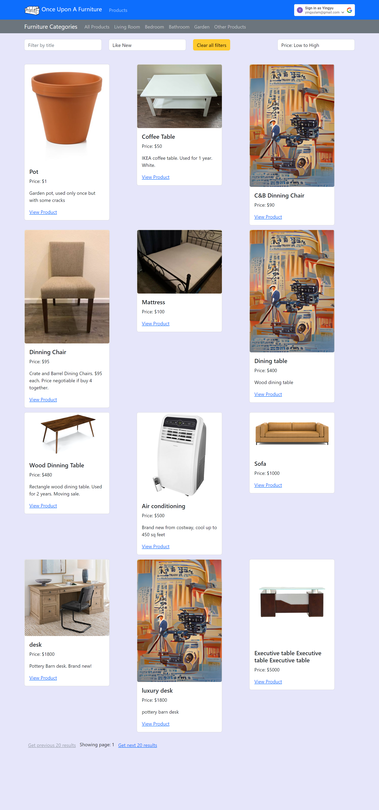
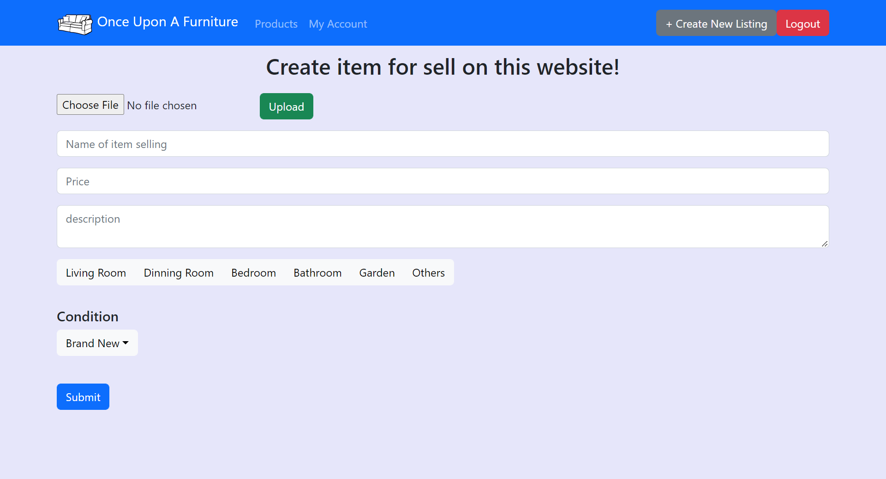
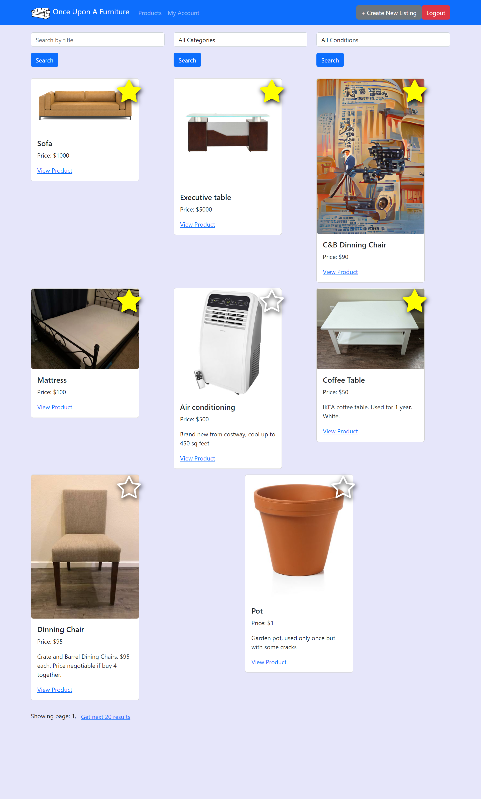
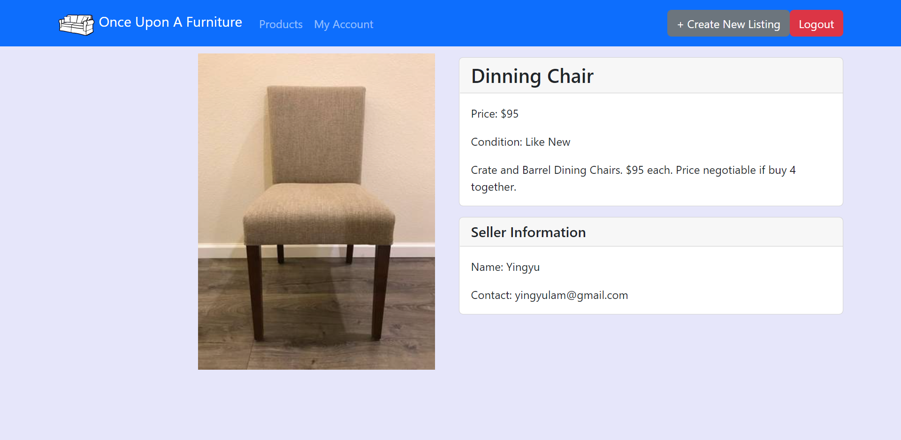
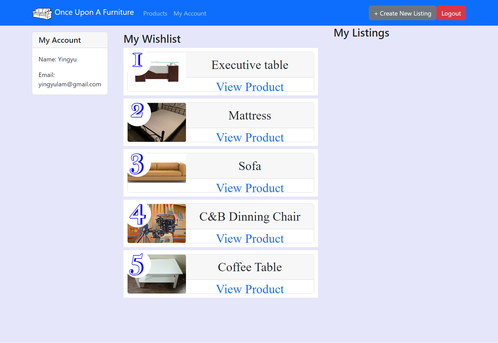

<h1>Project Information</h1>

Team name: Peter in Raincouver

Team members: Peter, Yingyu (Rain)

Project idea: Once Upon A Furniture. An online platform for used furniture buy and sell.

Source of starter code: Rain's Movie Time Project in CS5610, Summer 2022

Link to the app: https://furnitureapp-frontend.herokuapp.com/

# Furniture-frontend

<h1>Iteration 2</h1>

<h2>Peter: </h2>

1. Added the selling history to the user profile page. 

2. Created a navigation bar to look for furniture by categories.

3. Improve the fiter functionality so we can filter by different features at the same time.

<h2>Rain: </h2>

1. Added a location section in the uploadItem page with autocomplete.

2. Added a map in the product page to show the location of the listing.

3. Working on the sort by price/date functionalities.

<h4>Issues</h4>
- We haven't worked on uploading multiple pictures for a listing yet.
- The sorting function is not fully implemented yet.
- We planned to put the navigation bar on the left side but haven't figured it how to do it yet.

<h1>Iteration 1</h1>

<h2>Peter:</h2>

Mainly worked on the create new listing page, connecting the frontend to database via backend. Worked more on the backend and building the database at Mongodb Altas. 
Also fixed some filtering issue and debug.

Create new listing page frontend:
This page is created solely for the user to upload items to sell. Only logged in user can access this page by clicking the “create New Listing” button on the upper right.
 

The inputs are (in order)
1. Image input, which at the back uses cloudinary as a platform to store user uploaded photos to the cloud, and generate a link. The photo can be accessed via an API link, and that is what get stored in the mongodb altas (more on the database later). The green “upload” button connects to the cloud platform and do the actual upload.
2. Name of the item selling, stores string
3. Price, stores number
4. Description, scalable text box which stores string
5. Category, divides the item into different locations in the house

<h2>Rain: </h2>

1. Created the GitHub repositories and provided the starter code for this project.
2. Worked on the homepage: modified the starter code and linked to the the new furniture database.
 - Each listing shows its product name, price, description and a link to the product detail page.
 - It provides search by name, search by category (living room, dinning room, bedroom, etc), and search by used condition functionalities.
 - The navigation bar provides links to the homepage, my account page and a selling page.
 

3. Worked on the product page: this page shows the product photo, product information and the seller information

4. Worked on the My Account page. This page contains the user's information, wishlist, and listing history (placeholder).

5. Adapted the codes from the starter code to this new project, such as modifying variable names, module names, and routes. 

<h4>Issues</h4>

- The new listing page can take only one picture. 
- Now the filter functions (search by category/condition) work independently. We aimed at creating a filter functionality that can takes multiple arguments.
- In the account page, the listing history is temporily a place holder. 

We will work on these issues in the next iteration.
